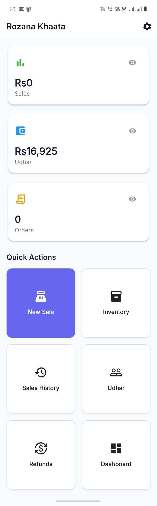
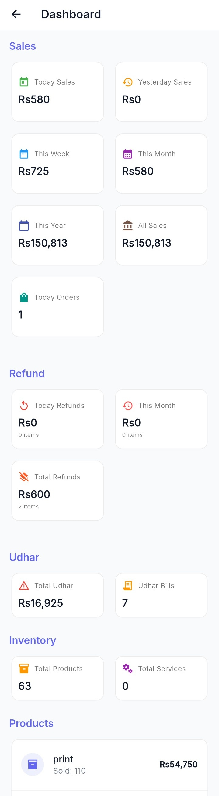
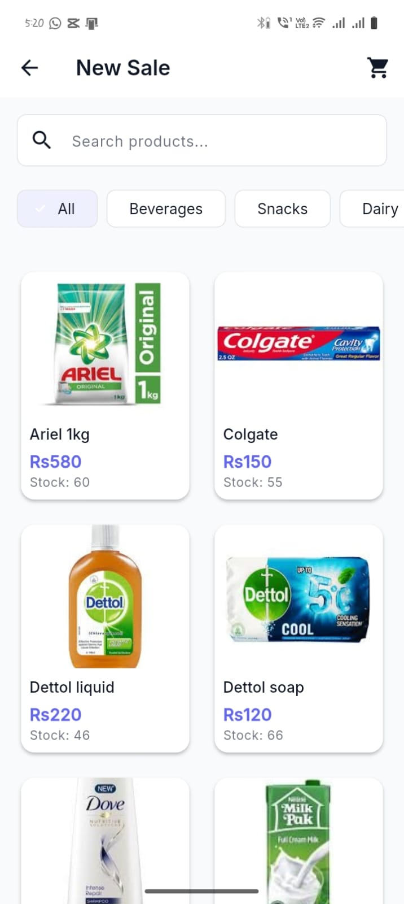
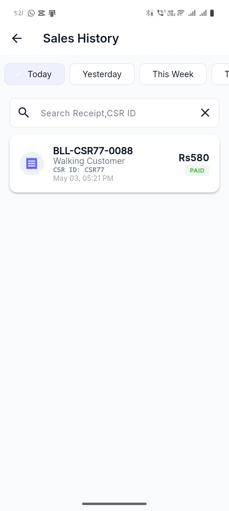
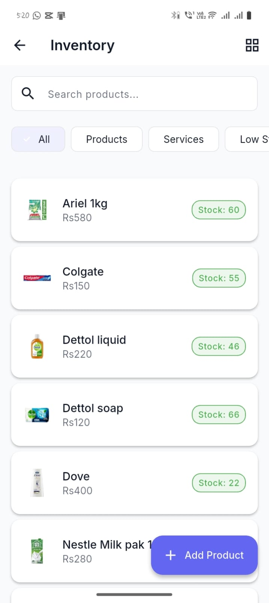
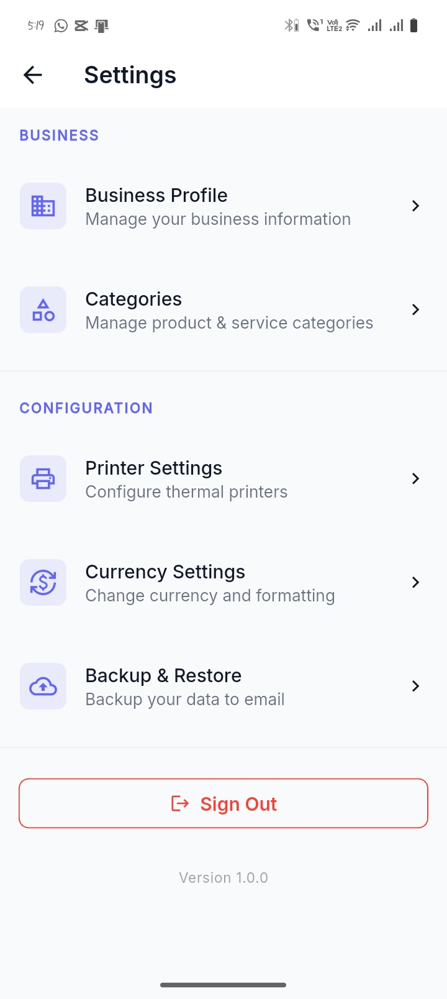
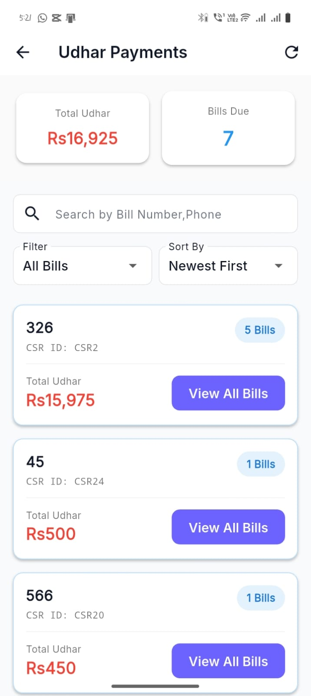

# 📱 Rozana Khaata – POS & Inventory Management

## 📖 Overview

**Rozana Khaata** is a production-ready POS application for small businesses in Pakistan. It handles daily sales, inventory, and udhar (credit) management - all working offline.

> **🚀 Live in Production**  
> Currently serving 50+ businesses across Pakistan

---

## ✨ Key Features

### 🛒 Sales Management
- Complete cart system
- Item & cart-level discounts
- Cash & Credit payments
- Sales history & refunds

### 👥 Udhar (Credit) Management
- Customer profiles
- Balance tracking
- Partial payments
- Due date tracking

### 📦 Inventory Control
- Add/Edit/Delete products
- Stock adjustments
- Low-stock alerts
- Product categories

### 🖨️ Printing System
- Bluetooth thermal printing
- ESC/POS support
- TSPL support (Zebra)
- PDF bill generation

### 📊 Analytics Dashboard
- Daily/Weekly/Monthly sales
- Top selling items
- Payment distribution
- Customer insights

### 💾 Backup & Restore
- One-tap backup
- Email backup
- One-tap restore

---

## 🏗️ Technology Stack

| Layer | Technology |
|-------|------------|
| Frontend | Flutter 3.x (Dart) |
| State Management | Provider |
| Local Database | SQLite (sqflite) |
| Authentication | Firebase Auth |
| Cloud | Cloud Firestore |
| Printing | ESC/POS + TSPL |
| PDF Generation | pdf package |
## 📸 Screenshots

| 🏠 Home | 📊 Dashboard | 🛒 Sales |
|:---:|:---:|:---:|
|  |  |  |

| 📜 Sales History | 📦 Inventory | ⚙️ Settings |
|:---:|:---:|:---:|
|  |  |  |

| 💰 Udhar |
|:---:|
|  |

## 🔒 Source Code Access

**This repository is for public showcase only.**

The full source code is maintained in a **private repository** to protect:
- 🔐 Business logic
- 🔐 Client data
- 🔐 Firebase credentials

### Request Access
1. Connect on [LinkedIn](https://www.linkedin.com/in/ibrahim-zia-b13894408?utm_source=share_via&utm_content=profile&utm_medium=member_android)
2. Email: ibrahimzia889@gmail.com

> **Note:** Access granted on a case-by-case basis.

---

## 📂 Repository Structure

rozana-khaata-portfolio/
├── README.md # Main documentation
├── LICENSE # MIT License
├── CONTRIBUTING.md # Contribution guidelines
├── CHANGELOG.md # Version history
├── docs/
│ └── architecture.md # Architecture details
├── screenshots/ # App screenshots
│ ├── home.jpeg
│ ├── sales.jpeg
│ └── dashboard.jpeg
└── .github/
├── ISSUE_TEMPLATE/
│ ├── bug_report.md
│ └── feature_request.md
└── workflows/
└── build.yml

